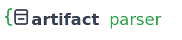

<div style="display: flex; align-items: center; justify-content: space-between;">
  <div>
    <h1 style="margin: 0;">artifact-parser</h1>
    <p style="margin: 0;">Turn data-tool JSON artifacts into typed, validated Python objects</p>
  </div>
  
</div>

[](https://pypi.org/project/artifact-parser/)

[](https://opensource.org/licenses/MIT)
[](https://www.python.org)
[](https://github.com/datnguye/artifact-parser/actions/workflows/ci.yml)
[](https://github.com/datnguye/artifact-parser/actions/workflows/ci.yml)

[](https://github.com/datnguye/artifact-parser)
[](https://www.buymeacoffee.com/datnguye)

A small, pluggable framework for turning the JSON artifacts that data tools spit
out into typed, validated Python objects. Point it at a blob, get back a pydantic
model — no manual key-spelunking, no guessing which schema version you're holding.

The framework is deliberately source-agnostic. Each **plugin** owns one family of
artifacts and registers itself with a shared registry. The first one ships in the
box: a full **dbt-core** parser (catalog, manifest, run-results, sources).

## Install

```bash
uv add artifact-parser     # or: pip install artifact-parser
```

## Quick start

The headline entry point sniffs any supported artifact and routes it to the right
plugin — you don't have to know what you're holding:

```python
import json
from artifact_parser import parse

artifact = json.loads(open("target/manifest.json").read())
model = parse(artifact)          # -> a ManifestV12 (or whatever version it is)
print(model.metadata.dbt_schema_version)
```

When you *do* know the artifact family, the dbt plugin's typed helpers are more
precise (and give better editor autocomplete):

```python
from artifact_parser.dbt import parse_manifest, parse_catalog

manifest = parse_manifest(json.loads(open("target/manifest.json").read()))
catalog = parse_catalog(json.loads(open("target/catalog.json").read()))
```

Hand it something it doesn't recognise and it tells you so, loudly, instead of
returning a half-populated object:

```python
from artifact_parser import parse, UnknownArtifactError

try:
    parse({"metadata": {"dbt_schema_version": "made-up/v99.json"}})
except UnknownArtifactError as exc:
    print(exc)   # No registered parser recognises this artifact. Tried: dbt.
```

## Supported dbt artifacts

| Artifact      | Versions | Generic parser        | Version-pinned parsers                |
|---------------|----------|-----------------------|---------------------------------------|
| `catalog`     | v1       | `parse_catalog`       | `parse_catalog_v1`                    |
| `manifest`    | v1–v12   | `parse_manifest`      | `parse_manifest_v1` … `_v12`          |
| `run-results` | v1–v6    | `parse_run_results`   | `parse_run_results_v1` … `_v6`        |
| `sources`     | v1–v3    | `parse_sources`       | `parse_sources_v1` … `_v3`            |

## Architecture

```
src/artifact_parser/
├── core/                 # the framework — no knowledge of any specific tool
│   ├── base.py           #   BaseArtifactModel (shared pydantic root)
│   ├── parser.py         #   ArtifactParser (the plugin contract)
│   ├── registry.py       #   ParserRegistry + the shared `registry` instance
│   └── exceptions.py     #   ArtifactParserError + friends
└── dbt/                  # the first plugin: dbt-core artifacts
    ├── plugin.py         #   DbtArtifactParser (implements ArtifactParser)
    ├── utils.py          #   schema-version sniffing
    ├── resources/        #   committed dbt-core JSON schemas (codegen input)
    └── generated/        #   droppable, rebuilt by `codegen dbt`
        ├── parser.py     #     parse_<artifact>[_vN] public API
        ├── version_map.py#     schema-version URL -> model class
        └── models/       #     typed pydantic models, one module per version
```

The generated code is walled off in `generated/`. You can `rm -rf` that whole
directory and rebuild it with `codegen dbt` (the package still imports while it's
gone — the dbt plugin just sits out until you regenerate).

The flow: a plugin answers *"is this mine?"* (`can_parse`) and *"make it typed"*
(`parse`). The registry tries plugins in registration order and returns the first
match. dbt registers itself on import, so `parse(...)` works out of the box.

## Adding a new parser

The whole point of the `core/` framework is that the second parser is cheap.
By hand:

1. Create `src/artifact_parser/<tool>/`.
2. Define your models on `BaseArtifactModel`.
3. Implement `ArtifactParser` (`name`, `can_parse`, `parse`) in `plugin.py`.
4. Register it in the package `__init__.py`: `registry.register(MyParser())`.
5. Import your plugin from the top-level `artifact_parser/__init__.py`.

That's it — `parse()` now routes matching artifacts to your plugin.

## Development

This project uses [uv](https://docs.astral.sh/uv/) and
[Task](https://taskfile.dev/). Common targets:

| Goal                            | Task           |
|---------------------------------|----------------|
| Sync the environment            | `task install` |
| Format + autofix                | `task format`  |
| Lint (format-check + ruff)      | `task lint`    |
| Run tests at 100% coverage      | `task test`    |

`task --list` shows everything. The test suite enforces **100% coverage** of the
framework and dbt dispatch code (the generated dbt models are excluded — they're
schema, not logic). Beyond the synthetic fixtures, real artifacts from a live dbt
build live in `tests/data/` and round-trip through the public `parse()` in
`tests/artifact_parser/dbt/test_roundtrip.py` — the only tests that exercise
populated nodes end to end.

One non-obvious rule the generator enforces: the generated models are relaxed to
pydantic `extra="ignore"` (not the `extra="forbid"` dbt's schemas imply), because
real artifacts carry fields the published schema omits. A strict model would
reject a perfectly good `manifest.json`. See `CLAUDE.md` for the why.

### CI

GitHub Actions back the same gates:

| Workflow            | What it does                                                                 |
|---------------------|-----------------------------------------------------------------------------|
| `ci.yml`            | Lint + 100%-coverage tests on Python 3.10–3.13, plus a **codegen-in-sync** job that fails if the committed `generated/` drifts from a fresh regen. |
| `schema-watch.yml`  | Weekly (and on demand): probes dbt's published schemas, regenerates, and opens a PR if a new version appeared. |
| `release.yml`       | Build + coverage gate, then PyPI Trusted Publishing on a published Release (or TestPyPI via manual dispatch). |

Action versions and Python deps are kept current by Dependabot.

## Agentic setup

This repo is wired for [Claude Code](https://claude.com/claude-code): a project
`CLAUDE.md`, a `parser-author` subagent that owns `src/`, slash commands
(`/test`, `/codegen`), secret-blocking and post-edit lint hooks, and the
[context7](https://github.com/upstash/context7) MCP for pulling fresh library
docs. See `CLAUDE.md` for the full tour. It will not write your code for you, but
it tries hard to keep you from shipping a failing coverage gate.

## Support

If this saved you from hand-spelunking a `manifest.json`, consider fuelling the
next release:

- ☕ [Buy me a coffee](https://www.buymeacoffee.com/datnguye)

[](https://www.buymeacoffee.com/datnguye)
